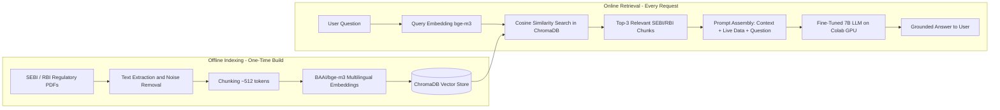
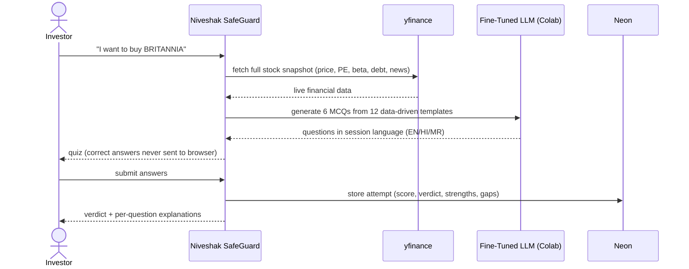

<div align="center">

# Niveshak SafeGuard

### Protecting India's First-Time Investor from FOMO, Scams and Impulsive Decisions

**Team: RELIC** | Hackathon: SANGYAN | Track: **Open Innovation**

[](https://fastapi.tiangolo.com/)
[](https://nextjs.org/)
[](https://www.trychroma.com/)
[](https://neon.tech/)
[]()
[]()

---

> **Disclaimer:** Niveshak SafeGuard is an educational tool only. It is **not** a SEBI-registered investment adviser. Nothing it outputs constitutes investment advice, a buy/sell signal, or a price prediction.

</div>

---

## Table of Contents

1. [The Problem We Solve](#the-problem-we-solve)
2. [What Track Does This Fit?](#what-track-does-this-fit)
3. [System Architecture](#system-architecture)
4. [RAG Pipeline - How We Ground the AI](#rag-pipeline---how-we-ground-the-ai)
5. [Streaming Database - Neon Postgres](#streaming-database---neon-postgres)
6. [LLM and Fine-Tuning](#llm-and-fine-tuning)
7. [Feature Deep Dive](#feature-deep-dive)
8. [Frontend Architecture](#frontend-architecture)
9. [Backend Architecture](#backend-architecture)
10. [Data Flow Diagrams](#data-flow-diagrams)
11. [Project Structure](#project-structure)
12. [Setup and Running](#setup-and-running)
13. [API Reference Summary](#api-reference-summary)
14. [Privacy and Guardrails](#privacy-and-guardrails)
15. [Team](#team)

---

## The Problem We Solve

India added **~10 crore new retail investors** between 2020 and 2024. The vast majority are first-timers who:

| Pain Point | Reality |
|---|---|
| Buy stocks they do not understand | 73% of retail investors have never read a company's quarterly results |
| Chase hype-driven tips from WhatsApp/Telegram | Scam investment groups exceed 5 lakh+ members on Telegram |
| Panic-sell during routine market corrections | Rs 1.5 lakh crore in retail losses recorded in a single FY correction |
| Face language barriers in financial education | Only ~12% of India speaks English confidently |
| Fall for unregistered advisors making illegal promises | SEBI receives 10,000+ complaints annually about investment fraud |

**Niveshak SafeGuard** is an AI-powered, multilingual investor safety companion that addresses every one of these problems - in **English, Hindi and Marathi**.

---

## What Track Does This Fit?

We submit under the **Open Innovation** track because our project synthesises solutions across multiple SANGYAN problem domains:

| SANGYAN Track | Our Contribution |
|---|---|
| **FinTech / Financial Inclusion** | Multilingual financial literacy + SEBI-grounded RAG for 100M+ new retail investors |
| **AI and ML** | Fine-tuned 7B LLM (QLoRA), multilingual RAG with bge-m3, real-time FOMO scoring |
| **Cybersecurity / Fraud Detection** | OCR-powered scam scanner detecting illegal SEBI registration claims |
| **Social Impact** | Behavioural guardrails that slow impulsive decisions; built for Bharat, not just metros |
| **Data Engineering** | Streaming database (Neon Postgres), real-time NSE/BSE market data pipeline |

Our project is a full-stack, production-grade system - not a prototype - that touches AI, data engineering, security, and social impact simultaneously.

---

## System Architecture

```
+------------------------------------------------------------------+
|                        USER'S BROWSER                            |
|               (React 19 + Next.js 16 App Router)                |
+------------------------+-----------------------------------------+
                         | HTTPS fetch
                         v
+------------------------------------------------------------------+
|                     NEXT.JS SERVER LAYER                         |
|  +------------------+   +------------------------------------+   |
|  |  App Router Pages |   |  /api/* Route Handlers            |   |
|  |  (Server + Client |   |  (server-only; secrets never      |   |
|  |   Components)     |   |   reach the browser)             |   |
|  +------------------+   +-----------+-----------+-----------+   |
+------------------------------------------+----------------------+
                                           |
               +---------------------------+--------------------+
               v                                                v
+---------------------------+              +-----------------------------+
|   NEON POSTGRES           |              |   FASTAPI ORCHESTRATOR      |
|   (Streaming Database)    |              |   (Local Python backend)    |
|                           |              |                             |
|  - fomo_profiles          |              |  - Session management       |
|  - safety_attempts        |              |  - RAG retrieval            |
|  - chat_messages          |              |  - Live market data         |
|  - watchlist              |              |  - FOMO scoring             |
|  - holdings               |              |  - Quiz engine              |
|  (serverless autoscale)   |              |  - OCR scam scanner         |
+---------------------------+              |  - Voice (ASR + TTS)        |
                                           +-------------+---------------+
                                                         |
               +-----------------------------------------+-----------+
               |                        |                             |
               v                        v                             v
+----------------------+  +----------------------+  +----------------+
|   CHROMADB           |  |   COLAB T4 GPU        |  |   YFINANCE     |
|   (Vector Store)     |  |   (LLM Inference)     |  |   (NSE Data)   |
|                      |  |                        |  |               |
|  BAAI/bge-m3         |  |  Fine-Tuned 7B LLM    |  |  Price, OHLC  |
|  SEBI/RBI chunks     |  |  Gradio API endpoint   |  |  52-wk, Beta  |
+----------------------+  +----------------------+  +----------------+
```

---

## RAG Pipeline - How We Ground the AI

One of the most critical components of Niveshak SafeGuard is the **Retrieval-Augmented Generation (RAG)** pipeline. Instead of relying solely on the LLM's training data, every user question is first grounded in actual SEBI and RBI regulatory documents.



### Why BAAI/bge-m3?

We chose the **BGE-M3** embedding model specifically because:
- It is **truly multilingual** - supports English, Hindi, and Marathi in the same vector space
- Queries in Hindi about a topic can retrieve the correct English SEBI document chunks
- It is compact enough to run locally on CPU alongside the FastAPI server

### RAG at Query Time

For every `/chat` request, the FastAPI orchestrator:
1. Embeds the user's message with `bge-m3`
2. Retrieves the **3 most semantically similar** SEBI/RBI document chunks from ChromaDB
3. Detects any NSE stock name mentioned (from a map of ~100 prominent stocks)
4. Fetches **live market data** for that stock via `yfinance`
5. Assembles a rich **grounded context block** (RAG chunks + live data)
6. Passes `(user_prompt, context, system_prompt)` to the LLM on Colab

The response field `"rag_sources_used": true` confirms when RAG context influenced the answer.

---

## Streaming Database - Neon Postgres

Niveshak SafeGuard uses **Neon Postgres** as its persistent, serverless streaming database for all structured data that must survive across browser sessions.

### Why Neon?

| Requirement | Why Neon? |
|---|---|
| **Serverless autoscaling** | Next.js is deployed on the edge; Neon scales to zero between requests, matching perfectly |
| **Database branching** | Isolated dev/prod environments without touching production data |
| **Connection pooling** | Built-in pooler handles many simultaneous Next.js serverless function connections |
| **Edge replication** | Low-latency reads, crucial for the always-visible FIN score in the TopBar |
| **Real-time migrations** | Drizzle ORM + direct connection URL enables zero-downtime schema updates |

### Database Schema

```
+-----------------------------------------------------------------------+
|                           NEON POSTGRES                               |
|                                                                       |
|  +---------------------+      +------------------------------------+  |
|  |   fomo_profiles     |      |       safety_attempts              |  |
|  |---------------------|      |------------------------------------|  |
|  | visitor_id (PK)     |<-----| visitor_id (FK)                    |  |
|  | base_score          |      | id (PK)                            |  |
|  | language_signal     |      | ticker                             |  |
|  | returns_signal      |      | score / total / level / eligible   |  |
|  | portfolio_signal    |      | verdict (text)                     |  |
|  | fin_score (0-100)   |      | strengths / gaps (jsonb)           |  |
|  | updated_at          |      | created_at                         |  |
|  +---------------------+      +------------------------------------+  |
|                                                                       |
|  +---------------------+      +------------------------------------+  |
|  |   chat_messages     |      |   watchlist / holdings             |  |
|  |---------------------|      |------------------------------------|  |
|  | id (PK)             |      | visitor_id + symbol                |  |
|  | visitor_id          |      | quantity / avg_cost / bought_at    |  |
|  | role (user/asst)    |      +------------------------------------+  |
|  | content (text)      |                                             |
|  | rag_used / live_used|                                             |
|  | created_at          |                                             |
|  +---------------------+                                             |
+-----------------------------------------------------------------------+
```

### Streaming / Real-Time Events

The FIN score is **event-driven** and recomputed live on every significant user action:

```
Chat turn completed
Watchlist modified   -->  recomputeFomo(visitorId)  -->  Neon UPDATE  -->  TopBar re-renders
Quiz submitted              |
Holdings changed            +-- language_signal  (chat wording analysis)
                            +-- returns_signal   (portfolio 52-wk RSI)
                            +-- portfolio_signal (sector concentration)
```

---

## LLM and Fine-Tuning

### Model: Fine-Tuned 7B (QLoRA)

| Parameter | Value |
|---|---|
| Base Model | Qwen2.5-7B-Instruct (4-bit quantized) |
| Fine-tuning Method | **QLoRA** (4-bit quantized base + LoRA adapters) |
| Framework | **Unsloth** (2-5x faster than vanilla PEFT) |
| Training Hardware | Free **Google Colab T4 GPU** |
| Training Steps | 150 |
| Context Length | 4096 tokens |
| Languages | English, Hindi, Marathi |

### Training Dataset

The model was fine-tuned on a custom multilingual dataset built from:

1. **SEBI/RBI PDFs** - Synthetic Q&A generated via GPT-4o-mini with Pydantic Structured Outputs, fixed teaching schema: *Explanation, Analogy, Example, Common Misconception*
2. **FiQA Dataset** (Hugging Face) - Filtered to remove irrelevant Wall Street jargon
3. **Translated Data** - Hindi and Marathi finance Q&A pairs in identical JSONL schema

### Answer Modes

```
Plain Mode (first question):
  -> Short, 2-4 sentence answer, conversational tone in the session language

Detailed Mode (user asks "explain in detail"):
  -> Four sections: Explanation, Analogy, Example, Common Misconception (~2048 tokens)
```

### Hosting on Colab

```
Colab T4 GPU
   |
   +- load_in_4bit = True (Unsloth FastLanguageModel)
   +- max_seq_len = 4096
   +- FastLanguageModel.for_inference()
   |
   +- gradio.Interface(
        inputs: [user_prompt, context, system_prompt],
        outputs: [text],
        share=True  ->  public gradio.live endpoint
      )
```

---

## Feature Deep Dive

### 1. Multilingual AI Financial Assistant

```
User: "Mujhe Reliance mein invest karna chahiye?"
         |
         +-> RAG: Top-3 SEBI/NISM chunks on equity investment principles
         +-> yfinance: RELIANCE.NS -> live price, 52-wk range, Beta
         +-> Context block assembled (RAG chunks + live market data)
         +-> Fine-Tuned LLM -> Hindi plain-mode answer, SEBI-grounded reasoning
```

- Supports **English, Hindi, Marathi** seamlessly in one session
- Multi-turn memory: last 6 messages sent to model; last 40 stored in Neon
- `rag_sources_used` and `live_data_used` flags returned with every response

---

### 2. FIN Score - FOMO, Impulsivity, Negligence

The FIN score is Niveshak SafeGuard's flagship behavioural metric - a **0-100 composite score**:

```
FIN Score = 0.45 x base_score
           + 0.20 x language_signal
           + 0.05 x returns_signal
           + 0.30 x portfolio_signal
```

| Signal | Source | What It Measures |
|---|---|---|
| `base_score` | 6-question FIN quiz | Fundamental financial knowledge baseline |
| `language_signal` | Chat message analysis | Hype words, urgency, "all-in" phrases |
| `returns_signal` | Portfolio returns via yfinance | Chasing 52-wk highs, high RSI stocks |
| `portfolio_signal` | Holdings in Neon | Sector concentration, value asymmetry |

Score Bands:

```
  0 --------- 35 --------- 70 --------- 100
  |  GREEN    |   YELLOW   |    RED     |
  | Planned   |  Momentum  | High FOMO  |
  | Investor  |  Chasing   |  Warning   |
```

---

### 3. "License Before You Buy" Safety Quiz



| Score | Level | Advice |
|---|---|---|
| >= 80% | Well Prepared | Proceed with disciplined position sizing |
| 50-79% | Partially Prepared | Revise weak areas; start with small position |
| < 50% | Not Yet Ready | Learn fundamentals before committing money |

---

### 4. FOMO Scorer

| Signal | Max Points | Detection |
|---|---|---|
| Linguistic Urgency | +30 | "rocket", "multibagger", "sure shot", "urgent" |
| Concentration Risk | +20 | "all my savings", "all in", "put everything" |
| Technical Stretch | +30 | Price within 5% of 52-wk high AND RSI > 75 |

---

### 5. Scam Screenshot Scanner

```
WhatsApp Screenshot
        |
        v
  Tesseract OCR --> Raw text extraction
        |
        v
  Pattern Matching:
    +- SEBI registration numbers (INA/INH/INZ + 9 digits)?  -> Registered
    +- "guaranteed", "sure shot", "100%", "zero risk"?       -> Illegal claim
    +- "daily profit" promises?                               -> Fraudulent
        |
        v
  Severity: RED | YELLOW | GREEN | UNREADABLE
```

The image is **never stored** - processed in memory and discarded immediately.

---

### 6. Volatility Monitor

A background task runs every 60 seconds watching a configured watchlist:

- **Trigger:** Any stock falls >= 2% from previous close
- **Response:** Educational intervention ("rupee cost averaging", "do not panic sell")
- **Demo mode:** Simulate a drop for live demonstrations outside market hours

---

### 7. Voice - Speak and Listen

- **Input:** Browser records audio -> Whisper small transcription -> full chat pipeline -> text + MP3 returned
- **Output:** Any on-screen text -> gTTS -> `audio/mpeg` in the session language

---

## Frontend Architecture

**Stack:** Next.js 16 (App Router), React 19, Tailwind CSS v4, Framer Motion, Recharts, next-intl, Zustand, Drizzle ORM

### Server-Side Boundary

```
Browser (Client Components)
    |
    |  Never talks directly to FastAPI backend
    |  Never sees LLM_BACKEND_URL or API keys
    |
    v
Next.js /api/* Route Handlers  (server-only boundary)
    |
    +-> Neon Postgres (drizzle-orm)
    +-> Yahoo Finance JSON API (server-side)
    +-> FastAPI LLM backend (x-api-key, server-only)
```

**Anonymous Identity:** No accounts, no login. A random `sg_vid` httpOnly cookie is minted on first visit. All data in Neon is keyed by this anonymous visitor ID.

### Pages

| Route | Description |
|---|---|
| `/[locale]` | Marketing landing page |
| `/[locale]/dashboard` | Market pulse, watchlist, FIN score card, quick actions |
| `/[locale]/markets` | Search, indices, gainers/losers |
| `/[locale]/stock/[symbol]` | Rich stock page: Area/Line/Candle/Kagi charts, fundamentals, quiz CTA |
| `/[locale]/safety-quiz/[symbol]` | Source -> screenshot scan -> 6-question quiz |
| `/[locale]/safety-quiz/[symbol]/result` | Verdict report card with strengths, gaps, explanations |
| `/[locale]/portfolio` | Educational holdings manager (lots, value, P&L) |
| `/[locale]/fomo-quiz` | 6-question FIN baseline quiz |
| `/[locale]/safety/scan` | Standalone scam screenshot scanner |

---

## Backend Architecture

**Stack:** FastAPI, ChromaDB, BAAI/bge-m3, Whisper small, gTTS, Tesseract, yfinance, gradio_client

### Orchestrator Responsibilities

```
FastAPI Orchestrator
+-- Session Manager       (in-memory: chat history, language, quiz sessions)
+-- RAG Retriever         (ChromaDB + bge-m3 -> top-3 chunks)
+-- Market Data Agent     (yfinance -> stock detection -> live context)
+-- Quiz Engine           (12 data-driven templates x 3 languages)
+-- FOMO Scorer           (linguistic + technical signals)
+-- Volatility Monitor    (background task, 60s poll)
+-- Scam Scanner          (Tesseract OCR + pattern matching)
+-- ASR                   (Whisper small)
+-- TTS                   (gTTS -> audio/mpeg)
```

### Split-Tier Design

```
Local Machine (CPU)                         Google Colab (free T4 GPU)
+----------------------+                   +---------------------------+
|  FastAPI Orchestrator| ----> HTTP ----->  |  Fine-Tuned 7B LLM        |
|  (~500 MB RAM)       |                   |  Gradio API               |
|  ChromaDB on disk    | <---- text ------  |  load_in_4bit=True        |
+----------------------+                   +---------------------------+
```

---

## Data Flow Diagrams

### Complete Chat Request Flow

```
User sends: "Should I buy Infosys?"
                |
                v
    Browser -> /api/assistant (Next.js route handler)
                |
                +- Reads visitor cookie -> session_id
                +- Forwards to FastAPI /chat
                |
                v
    FastAPI Orchestrator:
       1. Detect "Infosys" -> ticker: INFY.NS
       2. ChromaDB: embed question -> retrieve top-3 SEBI equity chunks
       3. yfinance("INFY.NS"): live price, 52w range, Beta
       4. Build context block: SEBI chunks + live market data
       5. Call Colab Gradio API: { user_prompt, context, system_prompt }
       6. Receive LLM response text
                |
                v
    /api/assistant (Next.js):
       - Persist user + assistant turns to Neon chat_messages
       - Trigger recomputeFomo(visitorId) -> update fomo_profiles in Neon
       - Return response to browser
                |
                v
    Browser: renders answer, FIN score in TopBar updates live
```

---

## Project Structure

```
Niveshak_SafeGuard/
|
+-- README.md                          <- You are here
|
+-- frontend/                          <- Next.js 16 web application
|   +-- src/
|   |   +-- app/
|   |   |   +-- [locale]/
|   |   |   |   +-- (public)/          landing, select-language
|   |   |   |   +-- (app)/             dashboard, markets, stock, safety,
|   |   |   |                          portfolio, profile, fomo-quiz
|   |   |   +-- api/                   server-only route handlers
|   |   +-- components/
|   |   |   +-- ui/                    Button, Card, Modal, Gauge, Chart, Toast
|   |   |   +-- features/              shell, market, stock, safety, fomo,
|   |   |                              portfolio, chat, voice, guide
|   |   +-- db/                        drizzle schema + Neon client
|   |   +-- lib/
|   |   |   +-- backend/               server-only FastAPI client + schemas
|   |   |   +-- market/                server-only Yahoo Finance client
|   |   |   +-- fomo-signals.ts        pure FIN scoring mathematics
|   |   |   +-- fomo-recompute.ts      event-driven FIN orchestrator
|   |   |   +-- safety.ts              quiz helpers, ticker map
|   |   +-- messages/
|   |   |   +-- en.json                English strings
|   |   |   +-- hi.json                Hindi strings
|   |   |   +-- mr.json                Marathi strings
|   |   +-- proxy.ts                   visitor cookie + language gate middleware
|   +-- drizzle/                       SQL migration files
|
+-- backend/
    +-- RELIC-Backend/                 <- FastAPI orchestrator
        +-- main.py                    FastAPI app + all route handlers
        +-- chroma_db/                 ChromaDB vector store (SEBI/RBI chunks)
        +-- data_prep/                 PDF extraction + dataset generation scripts
        +-- training/                  QLoRA fine-tuning scripts (Unsloth)
        +-- README.md                  Detailed backend documentation
```

---

## Setup and Running

### Prerequisites

| Component | Requirement |
|---|---|
| Node.js | 20+ (for Next.js 16) |
| Python | 3.11 or 3.12 |
| Neon Postgres | Serverless database account |
| Google Colab | T4 GPU (for LLM inference) |
| Tesseract OCR | UB Mannheim build (Windows) or brew install tesseract |
| ffmpeg | winget install ffmpeg (Windows) or brew install ffmpeg |

### Backend Setup

```powershell
cd backend/RELIC-Backend
python -m venv .venv
.venv\Scripts\Activate.ps1

pip install fastapi uvicorn python-multipart pydantic pillow pytesseract yfinance pandas gradio_client langchain-chroma langchain-huggingface gtts torch librosa transformers

uvicorn main:app --host 0.0.0.0 --port 8000
# API Docs: http://127.0.0.1:8000/docs
```

> After starting the Colab notebook, set `COLAB_API_URL` in `main.py` to the printed Gradio endpoint.

### Frontend Setup

```bash
cd frontend
npm install

# Create .env.local and fill in:
# DATABASE_URL         (Neon pooled connection string)
# DIRECT_URL           (Neon direct connection string, for migrations)
# LLM_BACKEND_URL      (FastAPI backend base URL)
# LLM_BACKEND_API_KEY  (shared secret for x-api-key header)
# NEXT_PUBLIC_APP_URL  (public URL of this app)

npm run db:migrate
npm run dev
```

> **Demo without backend:** Set `USE_MOCK_BACKEND=true`. All features fall back to deterministic mocks.

---

## API Reference Summary

### Backend (FastAPI)

| Method | Endpoint | Description |
|---|---|---|
| `GET` | `/` | Health check (`rag_loaded`, `colab_connected`) |
| `POST` | `/chat` | Multilingual AI chat with RAG + live data |
| `GET` | `/chat/history/{session_id}` | Conversation history |
| `POST` | `/language` | Set session language (`en`/`hi`/`mr`) |
| `POST` | `/quiz/generate` | Generate 6-question stock safety quiz |
| `POST` | `/quiz/submit` | Grade quiz, return verdict + feedback |
| `POST` | `/analyze-fomo` | Score message impulsivity (0-100) |
| `GET` | `/market-alerts` | Volatility monitor alerts |
| `POST` | `/scan-image` | OCR + pattern-match scam scanner |
| `POST` | `/voice/speak` | Text to MP3 audio (gTTS) |
| `POST` | `/voice/listen` | Audio to transcript to chat reply + audio |

### Frontend API Routes (Next.js - server-only)

| Method | Route | Upstream |
|---|---|---|
| `POST` | `/api/assistant` | FastAPI `/chat` |
| `GET/POST` | `/api/fomo` | Neon (FIN quiz) |
| `GET/POST/DELETE` | `/api/holdings` | Neon |
| `GET/POST/DELETE` | `/api/watchlist` | Neon |
| `GET` | `/api/market/trending` | Yahoo Finance |
| `GET` | `/api/market/[symbol]` | Yahoo Finance |
| `POST` | `/api/fraud-scan` | FastAPI `/scan-image` |
| `POST` | `/api/safety-quiz` | FastAPI `/quiz/generate` |
| `POST` | `/api/safety-quiz/submit` | FastAPI `/quiz/submit` + Neon |
| `POST` | `/api/voice/speak` | FastAPI `/voice/speak` |
| `POST` | `/api/voice/listen` | FastAPI `/voice/listen` |

---

## Privacy and Guardrails

### Privacy by Design

- **No accounts, no login.** Users are identified only by an anonymous `sg_vid` httpOnly cookie with no link to personal identity.
- **Screenshots are never stored.** Uploaded images are processed entirely in memory and discarded immediately.
- **Audio is never stored.** Voice recordings are transcribed in-memory and discarded.
- **Secrets never reach the browser.** The FastAPI backend URL, API key, and Neon connection strings are exclusively server-side environment variables.

### Product Guardrails

- No stock tips, no buy/sell/hold signals
- No price predictions or price targets
- No personalised investment recommendations
- Every AI output is educational and honest about uncertainty
- The app deliberately **slows the user down** before acting

### Known Limitations

| Limitation | Detail |
|---|---|
| In-memory backend sessions | Chat history and quiz sessions in FastAPI are lost on server restart; Neon persists all frontend-visible data |
| Colab link expiry | The Gradio `share=True` link changes on every Colab runtime restart; update `COLAB_API_URL` after each restart |
| Single-threaded inference | The Gradio interface queues requests; high concurrency will stack up wait times |
| yfinance coverage | Indian stock data from Yahoo can lag a few minutes; some fields missing for smaller companies |
| Educational thresholds | The 10% single-stock cap, 2% drop alert, and RSI-75 FOMO trigger are educational rules of thumb, not regulatory requirements |

---

## Team

<div align="center">

### Team RELIC

*Builders of Niveshak SafeGuard*

**SANGYAN Hackathon - Open Innovation Track**

---

*"The best time to learn about investing was before you invested. The second best time is now."*

---

**Niveshak SafeGuard** | Team RELIC | SANGYAN Hackathon

Built with love for India's 10 crore new retail investors

</div>
