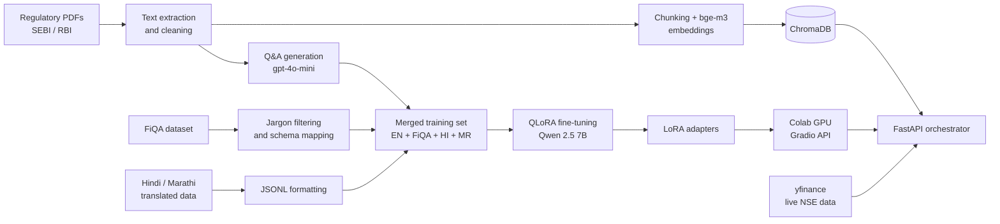
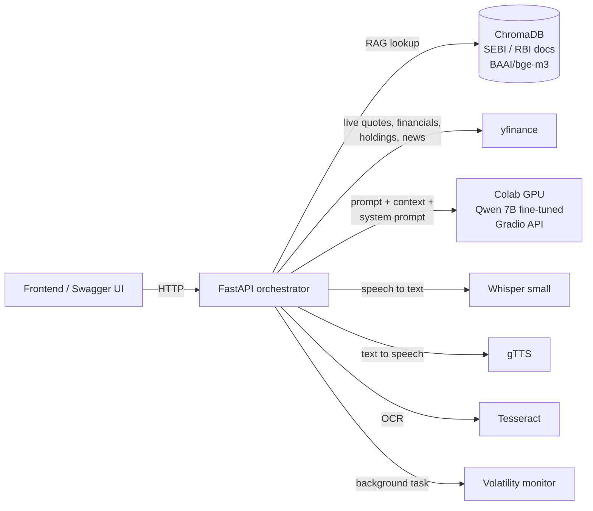

# 📈 BharatFinanceEdu (RelicLLM)

BharatFinanceEdu is an AI-powered, multilingual financial educator for Indian retail investors. The project covers the full pipeline: building an educational finance dataset, fine-tuning a 7B LLM (Qwen 2.5) on it, grounding the model with an offline RAG knowledge base of SEBI and RBI guidelines, connecting it to live NSE market data, and serving everything through a FastAPI backend with behavioural guardrails that slow users down before impulsive investment decisions.

> **Disclaimer:** BharatFinanceEdu is an educational tool. It is not a SEBI-registered investment adviser and nothing it returns is investment advice.

---

## Table of contents

1. [Why this project exists](#why-this-project-exists)
2. [Project pipeline](#project-pipeline)
3. [Data preparation](#data-preparation)
4. [Model training](#model-training)
5. [RAG knowledge base and market data](#rag-knowledge-base-and-market-data)
6. [Hosting the LLM on Google Colab](#hosting-the-llm-on-google-colab)
7. [Backend architecture](#backend-architecture)
8. [Features](#features)
9. [Setup](#setup)
10. [Running the server](#running-the-server)
11. [API reference](#api-reference)
12. [How the suitability quiz works](#how-the-suitability-quiz-works)
13. [Configuration](#configuration)
14. [Troubleshooting](#troubleshooting)
15. [Known limitations](#known-limitations)

---

## Why this project exists

Most first-time Indian investors make decisions from social media tips, WhatsApp forwards and fear of missing out. Three problems repeat:

| Problem | What BharatFinanceEdu does |
|---|---|
| People buy stocks they do not understand | A "License Before You Buy" quiz built from the stock's live data, with a verdict on where the user is strong and where they are not |
| Impulsive, hype-driven buying | A FOMO and impulse scorer that reads the user's message and the stock's technical stretch |
| Panic selling on sudden drops | A background volatility monitor that sends calm, educational interventions |
| Scam "sure shot" tips from unregistered advisers | An OCR scanner that checks screenshots for SEBI registration numbers and illegal claims |
| Language barriers | Full support for English, Hindi and Marathi, including speech input and output |

---

## Project pipeline

The project is built in five phases:



1. **Data preparation:** build a clean, multilingual, education-focused finance dataset.
2. **Model training:** fine-tune Qwen 2.5 7B with QLoRA on a free T4 GPU.
3. **RAG and market data:** build the offline SEBI/RBI knowledge base and the live stock data layer.
4. **Model hosting:** serve the fine-tuned model from Google Colab through a Gradio API.
5. **Backend:** a FastAPI orchestrator that combines the model, RAG, live data and guardrails into one API.

---

## Data preparation

- **Regulatory text extraction.** Raw SEBI and RBI PDFs are converted to text. Noise such as tables of contents, indexes, headers and footers is stripped, and the cleaned documents are saved for both dataset generation and the RAG knowledge base.
- **Synthetic Q&A generation.** The cleaned text is fed to `gpt-4o-mini` using Pydantic Structured Outputs, which forces every generated sample into a fixed teaching schema: **Explanation, Analogy, Example and Common Misconception**. This produces the base English educational dataset.
- **FiQA filtering.** The FiQA financial Q&A dataset is downloaded from Hugging Face. Corporate and Wall Street jargon (for example EBITDA and swaps) is removed so the remaining questions suit Indian retail investors, and the schema is standardised to match the base dataset.
- **Multilingual data.** A translated spreadsheet of finance Q&A in Hindi and Marathi is parsed and converted into valid JSONL rows in the same schema.
- **Merged master dataset.** English, filtered FiQA, Hindi and Marathi samples are merged into a single training file ready for fine-tuning.

---

## Model training

| Item | Value |
|---|---|
| Base model | `Qwen2.5-7B-Instruct-bnb-4bit` |
| Method | QLoRA (4-bit quantised base with LoRA adapters) |
| Framework | Unsloth |
| Hardware | Free Google Colab T4 GPU |
| Training length | 150 steps |
| Languages | English, Hindi, Marathi |
| Output | LoRA adapters for the fine-tuned BharatFinanceEdu model |

After training, inference is tested in all three languages and the LoRA adapters are exported so the model can be reloaded for serving.

---

## RAG knowledge base and market data

- **Offline knowledge base.** The cleaned SEBI/RBI documents are chunked and embedded with `BAAI/bge-m3` (a multilingual embedding model) into a local ChromaDB store. This is the authoritative ground truth: for every chat question, the backend retrieves the most relevant passages and passes them to the model as context.
- **Live market data.** An agentic utility built on `yfinance` detects which NSE stock a user is talking about and fetches live prices, 52-week ranges and risk profiles (Beta). For the suitability quiz it fetches a much richer snapshot, including quarterly results, debt, cash flow, holdings, news and the next results date.

---

## Hosting the LLM on Google Colab

The fine-tuned model runs on a Colab T4 GPU and is exposed to the backend as a small HTTP API through Gradio.

### How it is served

1. **Load the model.** Unsloth's `FastLanguageModel.from_pretrained` loads the exported fine-tuned model in 4-bit (`load_in_4bit=True`, `max_seq_length=4096`), then `FastLanguageModel.for_inference(model)` switches it to Unsloth's faster inference mode.
2. **Build the prompt.** Each request is turned into a chat with a system message and a user message. If the backend sends context (RAG passages and live market data), it is placed above the question as "Reference Context". The tokenizer's chat template formats it for Qwen.
3. **Generate.** Generation runs under `torch.inference_mode()` and the GPU cache is cleared before each request to avoid out-of-memory crashes.
4. **Expose the API.** A `gradio.Interface` with three text inputs (**user prompt, context, system prompt**) and one text output is launched with `share=True`, which gives a public `https://xxxx.gradio.live` link. Requests are queued so that rapid calls from the backend are handled one at a time.

### Generation settings

| Setting | Value | Reason |
|---|---|---|
| `max_new_tokens` | 2048 | Detailed four-section answers are not cut off |
| `temperature` | 0.7 | Natural, varied answers |
| `top_p` | 0.9 | Limits sampling to likely tokens |
| `repetition_penalty` | 1.05 | Discourages loops without breaking structured output |
| `bad_words_ids` | plain mode only | Blocks the labels Explanation, Analogy, Example and Misconception in short first answers |

The model was fine-tuned to always answer with labelled sections. The backend asks for **plain answer mode** on a user's first question, and the Colab function detects the phrase "Plain answer mode" in the system prompt and blocks those label words at the token level. When the user asks for more detail, the labels are allowed again.

### Connecting the backend

1. Run the Colab cell and copy the `gradio.live` link it prints.
2. Set it as `COLAB_API_URL` in the backend configuration and restart the server.
3. The link changes every time the Colab session restarts, so update it after each restart.
4. If the model cell is re-run in the same session, restart the Colab runtime first; otherwise a second copy of the model is loaded and the GPU runs out of memory.

---

## Backend architecture

The system uses a split-tier design so that the expensive GPU work stays on Colab while everything else runs locally.



**Local orchestrator.** Handles sessions, chat history, language preference, RAG retrieval, live market data, quiz generation and scoring, the FOMO scorer, volatility monitoring, OCR scam detection, speech recognition and speech synthesis.

**GPU inference (Colab).** Hosts the fine-tuned Qwen 7B model behind a Gradio interface. It receives three inputs (user prompt, context, system prompt) and returns text. It is used only by the chat endpoints. The quiz does not depend on it.

**Agentic data flow.** The orchestrator acts as the agent: it detects which stock the user is talking about, fetches live data with yfinance, retrieves SEBI guidance from ChromaDB, and passes all of it to the model as grounded context. The model never fetches data itself.

---

## Features

### 1. Financial assistant chat (`POST /chat`)

- Answers questions in the session language (English, Hindi or Marathi).
- Retrieves the three most relevant SEBI/RBI passages from ChromaDB for every question.
- Detects stock names in the message (about 100 prominent NSE stocks, for example "Reliance", "HDFC Bank", "L&T") and adds live price, 52-week range and Beta to the context.
- Keeps multi-turn memory per `session_id` (last 6 messages sent to the model, last 40 stored).
- **Two answer modes:**
  - **Plain mode (default):** a short, simple answer of 2 to 4 sentences with no headings or labels.
  - **Detailed mode:** triggered when the user asks for more, such as "explain in detail", "elaborate", "tell me more", "विस्तार से", "सविस्तर". The answer comes in four labelled sections: Explanation, Analogy, Example and Common Misconception.

### 2. "License Before You Buy" suitability quiz (`POST /quiz/generate`, `POST /quiz/submit`)

- Builds a quiz about the specific stock the user wants to buy, using a live snapshot of that stock.
- Questions come from 12 hand-written, data-driven templates in all three languages, so every answer key is calculated or rule-based and always correct.
- Six questions are sampled uniformly at random from the templates available for that stock, and options are shuffled.
- The result is a written verdict on where the user is strong and where they need to learn more, plus a readiness level. See [How the suitability quiz works](#how-the-suitability-quiz-works).

### 3. FOMO and impulse scorer (`POST /analyze-fomo`)

Scores how impulsive a planned trade looks, from 0 to 100:

| Signal | Points | How it is detected |
|---|---|---|
| Linguistic urgency | +30 | Hype words such as "rocket", "multibagger", "sure shot", "urgent" |
| Concentration risk | +20 | Phrases such as "all my savings", "all in", "put everything" |
| Technical stretch | +30 | Price within 5% of its 52-week high **and** 14-day RSI above 75 |

Zones: **GREEN** (0 to 35, planned), **YELLOW** (36 to 70, momentum chasing), **RED** (71 to 100, high FOMO warning). A `demo_mode` flag forces an overbought technical state for demonstrations.

### 4. Volatility alerts (`GET /market-alerts`)

- A background task checks a watchlist every 60 seconds.
- If a stock falls 2% or more against the previous close, the alert carries an educational intervention about not panic selling and about rupee cost averaging.
- `SIMULATE_STREAM = True` simulates a 3% drop so the feature can be demonstrated outside market hours.

### 5. Scam screenshot scanner (`POST /scan-image`)

- Accepts a screenshot (for example a WhatsApp or Telegram tip) up to 5 MB.
- Extracts text with Tesseract OCR.
- Looks for SEBI registration numbers (`INA`, `INH`, `INZ` followed by 9 digits).
- Flags illegal or suspicious claims such as "guaranteed", "sure shot", "100%", "zero risk", "daily profit".
- Returns a severity (`RED`, `YELLOW`, `GREEN` or `UNREADABLE`) and a plain-language verdict.

### 6. Voice (`POST /voice/listen`, `POST /voice/speak`)

- **Microphone:** the user's recording is transcribed with Whisper small, answered by the chat pipeline, and returned as text plus spoken audio.
- **Speaker:** reads any on-screen text aloud in the session language, for example the current quiz question and its options, or a chat answer. Markdown symbols are removed before speaking.

### 7. Language preference (`GET /languages`, `POST /language`)

The language is chosen once per session and applies to chat answers, quiz questions, quiz verdicts and speech. Supported: `en` (English), `hi` (Hindi), `mr` (Marathi).

---

## Setup

### Prerequisites

- Python 3.11 or 3.12 recommended (some ML libraries lag behind the newest Python releases)
- A Google Colab notebook with a T4 GPU for the language model (chat only)
- **Tesseract OCR** for `/scan-image`
- **ffmpeg** for `/voice/listen` when the browser records WebM or MP3 audio
- Internet access (yfinance, gTTS and the first Whisper download)

### 1. Create a virtual environment

Windows (PowerShell):

```powershell
python -m venv .venv
.venv\Scripts\Activate.ps1
```

If PowerShell blocks the script, run `Set-ExecutionPolicy -Scope Process -ExecutionPolicy RemoteSigned` first.

macOS / Linux:

```bash
python3 -m venv .venv
source .venv/bin/activate
```

### 2. Install Python dependencies

```bash
pip install fastapi uvicorn python-multipart pydantic pillow pytesseract yfinance pandas \
    gradio_client langchain-chroma langchain-huggingface gtts torch librosa transformers
```

`playsound3` is only needed if you run the speech module directly as a standalone script.

### 3. Install system tools

- **Tesseract:** on Windows install the UB Mannheim build to `C:\Program Files\Tesseract-OCR\`. The path is set at the top of the OCR module; change it if you install elsewhere. On macOS use `brew install tesseract`.
- **ffmpeg:** on Windows `winget install ffmpeg`, on macOS `brew install ffmpeg`. Restart the terminal afterwards.

### 4. Start the Colab inference server

Start the model on Colab as described in [Hosting the LLM on Google Colab](#hosting-the-llm-on-google-colab). Copy the `https://xxxx.gradio.live` link that Colab prints and set it in the backend configuration:

```python
COLAB_API_URL = "https://xxxx.gradio.live"
```


---

## Running the server

```bash
uvicorn main:app --host 0.0.0.0 --port 8000
```

- Interactive API docs: `http://127.0.0.1:8000/docs`
- Health check: `http://127.0.0.1:8000/`

On startup the server loads the `BAAI/bge-m3` embedding model and ChromaDB, then starts the volatility monitor. If ChromaDB cannot load, the server continues without RAG.

Do not run with `--reload` while testing quizzes: every file save restarts the server and clears all in-memory sessions.

---

## API reference

All request and response bodies are JSON unless stated otherwise. Every session-based endpoint uses a free-form `session_id` string chosen by the frontend.

### Health

`GET /`

```json
{ "status": "active", "rag_loaded": true, "colab_connected": false }
```

### Language

`GET /languages` lists supported languages.

`POST /language`

```json
{ "session_id": "user-42", "language": "hi" }
```

Unsupported codes return 400. Sessions without a choice default to English.

### Chat

`POST /chat`

```json
{ "session_id": "user-42", "message": "What is SIP?" }
```

```json
{
  "reply": "SIP means investing a fixed amount in a mutual fund at regular intervals...",
  "detailed": false,
  "rag_sources_used": true,
  "live_data_used": false
}
```

Send a follow-up such as `"explain it in detail"` to receive the labelled detailed answer (`"detailed": true`).

`GET /chat/history/{session_id}` returns the stored conversation.

Errors: 503 when the Colab server is unreachable.

### Quiz

`POST /quiz/generate`

```json
{ "session_id": "user-42", "target_stock": "Britannia" }
```

`target_stock` can be a company name from the ticker map or an NSE symbol (for example `BHEL`, or `INFY.BO` for BSE).

```json
{
  "session_id": "user-42",
  "ticker": "BRITANNIA.NS",
  "name": "BRITANNIA INDUSTRIES LTD",
  "beta": 0.41,
  "language": "en",
  "quiz": [
    {
      "category": "Capital Allocation",
      "question": "You have Rs 1,00,000 to invest and like BRITANNIA INDUSTRIES LTD. What is a prudent amount to put into this single stock?",
      "options": { "A": "...", "B": "...", "C": "...", "D": "..." }
    }
  ]
}
```

Correct answers are never sent to the frontend. Errors: 404 when no market data exists for the symbol.

`POST /quiz/submit`

```json
{
  "session_id": "user-42",
  "answers": [
    { "question_index": 0, "selected_option": "B" },
    { "question_index": 1, "selected_option": "A" }
  ]
}
```

Exactly one answer per question index is required (400 otherwise). A quiz can be submitted once; the session is deleted afterwards (404 on a second submit).

```json
{
  "ticker": "BRITANNIA.NS",
  "score": 4,
  "total": 6,
  "percentage": 66.7,
  "level": "Partially Prepared",
  "eligible": false,
  "verdict": "Partially Prepared to invest in BRITANNIA INDUSTRIES LTD: you answered 4 of 6 correctly. You show sound understanding of ... You need to work on ... before committing money. ...",
  "strengths": ["Risk Tolerance", "Diversification"],
  "gaps": [
    { "category": "Valuation", "correct": 0, "total": 1, "what_to_learn": ["..."] }
  ],
  "feedback": [
    {
      "category": "Valuation",
      "question": "...",
      "user_answer": "C",
      "correct_answer": "A",
      "is_correct": false,
      "explanation": "..."
    }
  ]
}
```

The `verdict`, questions, options and explanations are in the session language. The `level`, `strengths` and `gaps[].category` fields stay in English so the frontend can use them as keys.

### Voice

`POST /voice/speak` returns `audio/mpeg`.

```json
{ "session_id": "user-42", "text": "Text currently shown on screen" }
```

`POST /voice/listen` takes `multipart/form-data` with `session_id` and an `audio` file (up to 10 MB).

```json
{
  "transcript": "What is SIP?",
  "language": "en",
  "reply": "...",
  "detailed": false,
  "reply_audio_base64": "//OExAAA...",
  "audio_mime": "audio/mpeg",
  "rag_sources_used": true,
  "live_data_used": false
}
```

Frontend playback examples:

```javascript
// Speaker button
const res = await fetch(`${API}/voice/speak`, {
  method: "POST",
  headers: { "Content-Type": "application/json" },
  body: JSON.stringify({ session_id, text: displayedText }),
});
new Audio(URL.createObjectURL(await res.blob())).play();

// Reply from the microphone flow
new Audio(`data:audio/mpeg;base64,${data.reply_audio_base64}`).play();
```

Swagger's built-in audio player may show `0:00` for MP3 responses; that is a Swagger display issue, the audio itself is valid.

Errors: 400 (empty text or file), 413 (file too large), 422 (no speech detected or unreadable audio), 503 (speech service unreachable).

### FOMO scorer

`POST /analyze-fomo`

```json
{
  "message": "Should I put all my savings into Reliance? It is a multibagger rocket!",
  "ticker": "RELIANCE.NS",
  "demo_mode": true
}
```

```json
{
  "ticker": "RELIANCE.NS",
  "score": 80,
  "zone": "RED",
  "label": "High FOMO Warning",
  "advice": "SEBI warns against speculative 'hot tips'...",
  "reasons": ["Linguistic Urgency (...)", "Concentration Risk (...)", "Technical Stretch (...)"],
  "rsi": 82.5
}
```

`ticker` is optional; if missing, it is detected from the message.

### Market alerts

`GET /market-alerts?triggered_only=true`

```json
{
  "checked_at": "2026-10-04T09:00:00+00:00",
  "threshold_pct": -2.0,
  "simulated": true,
  "alerts": [
    {
      "ticker": "RELIANCE.NS",
      "prev_close": 1400.0,
      "current_price": 1358.0,
      "pct_change": -3.0,
      "triggered": true,
      "intervention": "Market fluctuations are normal; do not panic sell..."
    }
  ]
}
```

### Scam scanner

`POST /scan-image` takes `multipart/form-data` with an image `file`.

```json
{
  "text": "Join now! 100% guaranteed profit...",
  "sebi_numbers": [],
  "fraud_flags": ["100%", "guaranteed"],
  "severity": "RED",
  "verdict": "EXTREME DANGER. Unregistered provider making illegal promises. SCAM."
}
```

Errors: 415 (not an image), 413 (over 5 MB), 400 (cannot decode), 500 (OCR failed, usually Tesseract not installed).

---

## How the suitability quiz works

### 1. Live snapshot

`fetch_stock_snapshot()` collects the following with yfinance. Each field is fetched independently and skipped if unavailable.

- Price, 52-week high and low, distance from the 52-week high
- 1-month, 6-month and 1-year returns
- Beta, P/E, P/B, profit margin, revenue growth, sector, industry, market cap
- Last four quarters of revenue and net profit
- Total debt, cash, debt-to-equity, free cash flow
- Promoter/insider and institutional holding
- Last three news headlines and the next results date
- A short business summary

### 2. Question pool

Twelve templates turn the snapshot into questions. A template joins the pool only when the data exists **and** the correct answer is unambiguous.

| Category | Template | Included when |
|---|---|---|
| Risk Tolerance | Beta: expected fall if NIFTY falls 10% (calculated) | always |
| Risk Tolerance | Rupee loss on a random amount for a 10/20/30% NIFTY fall (calculated) | always |
| Risk Tolerance | Recent return: past returns do not guarantee future returns | always |
| Valuation | Meaning of a high P/E (30 or more) or a low P/E (under 15) | P/E outside the 15 to 30 band |
| Valuation | Price position in the 52-week range | price in the bottom 25%, middle 40 to 60% or top 25% of the range |
| Capital Allocation | Single-stock limit of about 10% of a random amount | always |
| Capital Allocation | Investing in parts over time (rupee cost averaging) | always |
| Diversification | Already holding two stocks of the same sector | always |
| Time Horizon | Money needed in 6 months belongs in an FD or liquid fund | always |
| Time Horizon | Handling the upcoming results date | results date available |
| Business Model | Quarterly profit trend: rising, falling or flat | at least 3 quarters and a clear trend (more than 10% change, or under 3%) |
| Business Model | Debt-to-equity above 1 or below 0.5 | not a financial-sector company |

Every template exists in English, Hindi and Marathi. Each question uses the stock's real numbers, random rupee amounts and shuffled options, so two quizzes for the same stock rarely look the same.

### 3. Sampling

`QUIZ_SIZE` questions (default 6) are drawn uniformly at random from the pool. Any stock with price history has at least 7 templates available.

### 4. Scoring and verdict

| Percentage correct | Level | Advice |
|---|---|---|
| 80% and above | Well Prepared | Proceed only with disciplined position sizing |
| 50% to 79% | Partially Prepared | Revise weak areas first; start small if investing |
| Below 50% | Not Yet Ready | Avoid buying for now; learn the basics first |

The verdict names the categories the user got fully right (strengths) and those with any wrong answer (gaps), and each gap lists the explanations to learn from. `eligible` is `true` at 80% or more, for frontends that unlock a "buy" action only after passing.

---

## Configuration

All settings are constants at the top of the FastAPI application.

| Constant | Default | Meaning |
|---|---|---|
| `COLAB_API_URL` | Gradio link | Colab inference endpoint; update after every Colab restart |
| `CHROMA_DIR` | `./chroma_db` | Vector store location |
| `EMBEDDING_MODEL` | `BAAI/bge-m3` | Embedding model for RAG |
| `HISTORY_WINDOW` | 6 | Messages of history sent to the model |
| `HISTORY_LIMIT` | 40 | Messages kept per session |
| `QUIZ_SIZE` | 6 | Questions per quiz |
| `MAX_UPLOAD_BYTES` | 5 MB | Image upload limit |
| `MAX_AUDIO_BYTES` | 10 MB | Audio upload limit |
| `WATCHLIST` | Reliance, Tata Motors PV, Eternal, Suzlon | Stocks checked by the volatility monitor |
| `DROP_THRESHOLD` | -2.0 | Daily percentage drop that triggers an alert |
| `POLL_SECONDS` | 60 | Monitor interval |
| `SIMULATE_STREAM` | `True` | Simulated drop for demos; set `False` for live data |
| `DEFAULT_LANGUAGE` | `en` | Language when a session has not chosen one |

To add a stock name, add an entry to `TICKER_MAP` in the market data module, for example `"bhel": "BHEL.NS"`.

---

## Troubleshooting

| Symptom | Cause and fix |
|---|---|
| `source` is not recognized (Windows) | Use `.venv\Scripts\Activate.ps1` in PowerShell |
| `WinError 10048` on startup | Port 8000 is in use. Find the process with `netstat -ano \| findstr :8000` and stop it with `taskkill /PID <pid> /F`, or use `--port 8001` |
| `tesseract is not installed or it's not in your PATH` | Install Tesseract and check the path set in the OCR module |
| `/voice/listen` returns 422 "Could not transcribe" | Install ffmpeg, then restart the terminal and server |
| `/chat` returns 503 | The Colab session stopped or the Gradio link changed; restart Colab and update `COLAB_API_URL` |
| `/quiz/submit` returns 404 | The quiz was never generated for that `session_id`, was already submitted, or the server restarted (sessions are in memory) |
| `/analyze-fomo` or `/market-alerts` returns 500 | The FOMO or volatility module is an old version that prints instead of returning a dictionary |
| Colab: "Some modules are dispatched on the CPU or the disk" | The previous model is still in GPU memory; use Runtime, Restart session, then load once |
| `HF_TOKEN` warning on startup | Harmless; set a Hugging Face token to remove it |

---

## Known limitations

- **In-memory state.** Chat history, quiz sessions and language choices are lost when the server restarts.
- **Model quality.** The 7B model's Hindi and Marathi output in chat can be uneven. The quiz avoids this by using hand-written templates.
- **yfinance coverage.** Indian stock data from Yahoo Finance can be delayed by a few minutes and some fields (holdings, financial statements) are missing for smaller companies; affected quiz templates are skipped automatically.
- **Single Colab instance.** The Gradio share link is temporary and the model serves one request at a time.
- **Ticker symbols change.** Renamed or demerged companies (for example Zomato to Eternal, Tata Motors after its demerger) must be updated in `TICKER_MAP`.
- **Not financial advice.** Thresholds such as the 10% single-stock guideline and the 2% drop alert are educational rules of thumb, not regulatory requirements.
