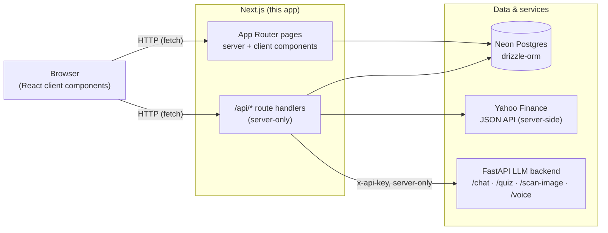
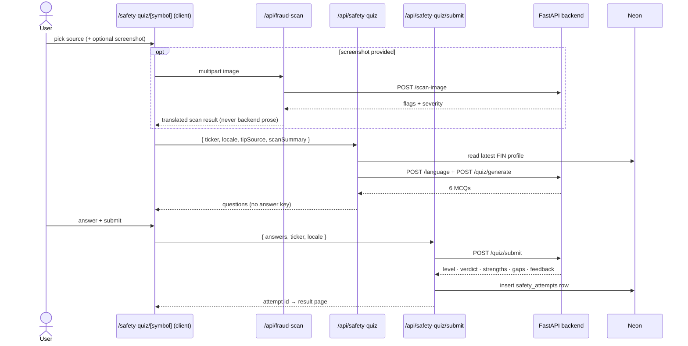
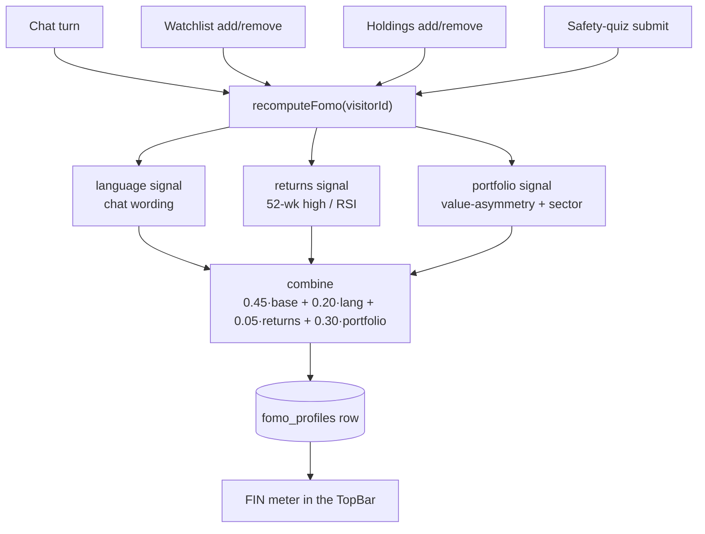

# 🛡️ Niveshak SafeGuard — Frontend

The web app for **Niveshak SafeGuard**, an educational, SEBI-aligned investor-safety
companion for Indian retail investors. It teaches investing basics, scores
behavioural impulsivity (the **FIN score**), warns about suspicious tips with a
screenshot scan, and runs a data-driven "License Before You Buy" safety quiz —
in **English, हिंदी and मराठी**.

> **Disclaimer:** Niveshak SafeGuard is educational only. It is **not** a
> SEBI-registered advisor and nothing it shows is investment advice. There is
> **no trading**: no buy/sell/hold, no price predictions, no tips.

---

## Table of contents

1. [What it does](#what-it-does)
2. [Tech stack](#tech-stack)
3. [Architecture](#architecture)
4. [Request flows](#request-flows)
5. [Features](#features)
6. [Pages (routes)](#pages-routes)
7. [API routes](#api-routes)
8. [Project structure](#project-structure)
9. [Getting started](#getting-started)
10. [Environment variables](#environment-variables)
11. [Scripts](#scripts)
12. [Internationalisation](#internationalisation)
13. [Testing](#testing)
14. [Privacy & guardrails](#privacy--guardrails)
15. [Notes & limitations](#notes--limitations)

---

## What it does

| Problem | What this frontend does |
|---|---|
| Buying stocks you don't understand | A **safety quiz** per stock with a written verdict, strengths and gaps |
| Impulsive, hype-driven buying | A **FIN score** (FOMO · Impulsivity · Negligence) with an explainer |
| Scam "sure shot" tips | A **screenshot scanner** that reads a tip and flags warning signs |
| Language barriers | Full **en / hi / mr** UI + voice (mic input, spoken output) |
| "Where do I even start?" | A guided **walkthrough** and an always-available finance assistant |

Everything is framed as education and awareness. The app deliberately slows the
user down before acting rather than pushing a trade.

---

## Tech stack

| Layer | Choice |
|---|---|
| Framework | **Next.js 16** (App Router, Turbopack, TypeScript strict) |
| UI | **React 19**, **Tailwind CSS v4** (design tokens via `@theme`) |
| Motion | **framer-motion** |
| Charts | **recharts** (+ custom SVG candlestick / Kagi) |
| Icons | **lucide-react** |
| i18n | **next-intl** (`en`, `hi`, `mr`), URL-prefixed (`/en/...`) |
| Validation | **zod** |
| Client state | **zustand** |
| Database | **Neon Postgres** + **drizzle-orm** / drizzle-kit |
| Backend | **FastAPI LLM backend** — reached only from server-side route handlers |
| Tests | **vitest** |

---

## Architecture

The browser **only ever talks to this app's `/api/*` route handlers**. Those
handlers run server-side and are the only place that touches the LLM backend,
Yahoo Finance, or Neon. Secrets never reach the client.



**Layers**

- **Anonymous identity.** No accounts. A random `sg_vid` httpOnly cookie is minted
  by `src/proxy.ts` (Next 16's renamed middleware) and identifies a browser so the
  FIN score, watchlist, holdings, chat history and quiz attempts persist on that
  device only.
- **Server components by default**; `"use client"` only where interactivity is
  needed. Data that must survive refresh is read directly from Neon in server
  components.
- **Server-only clients** (`src/lib/backend/*`, `src/lib/market/*`) import a
  `window` guard and are never bundled to the browser.

---

## Request flows

### Safety quiz (source → scan → quiz → result)



### FIN score recompute (event-driven)



The FIN score is anchored by the 6-question quiz (`base_score`) and nudged by the
three live signals above. See `src/lib/fomo-signals.ts` for the exact math.

---

## Features

### 1. Landing & onboarding
Marketing landing page, a first-run **language gate** (English / हिंदी / मराठी),
then a 6-question **FIN quiz** that sets the initial score.

### 2. Dashboard
Greeting, live market pulse, watchlist, trending and movers, the FIN score card
(click it for the explainer), quick actions, and a "check a tip for fraud" entry.

### 3. Markets & stock pages
Search (prefix-first ranking), indices, gainers/losers, and a rich stock page:
interactive chart with **Area / Line / Bars / Candles / Kagi** views, volatility
gauge, fundamentals, your holding card, and the safety-quiz CTA.

### 4. Safety quiz ("License Before You Buy")
Per-stock, LLM-generated questions; then a **verdict** with the API's readiness
level, strengths, gaps (what to learn) and per-question explanations.
Screenshot is optional but recommended.

### 5. FIN score (FOMO · Impulsivity · Negligence)
A single 0–100 behavioural score with bands (green / yellow / red) and an
explainer modal that shows the maths behind it.

### 6. Screenshot fraud scanner
Upload a tip screenshot (scan-only flow) → warning-sign flags + risk level.
The image is sent in memory only and never stored.

### 7. Portfolio (educational)
Record holdings (multiple lots per stock, with average cost and live P&L). No
orders are ever placed. Holdings also feed the FIN portfolio signal.

### 8. Assistant chat + voice
Multilingual finance Q&A with chat history, a microphone button (speech → text)
and a speaker button that reads replies aloud (approximate word highlighting,
pause/resume).

### 9. Guided walkthrough
A dependency-free, multi-page tour that spotlights each feature.

---

## Pages (routes)

All app pages are locale-prefixed: `/{locale}/...` where `locale ∈ {en, hi, mr}`.

| Route | Group | Description |
|---|---|---|
| `/[locale]` | public | Landing page (hero, features, how-it-works, trust strip) |
| `/[locale]/select-language` | public | First-run language picker |
| `/[locale]/dashboard` | app | Post-FIN home: market pulse, watchlist, movers, quick actions |
| `/[locale]/markets` | app | Search, indices, gainers/losers |
| `/[locale]/stock/[symbol]` | app | Stock detail: chart types, volatility, stats, holding, safety CTA |
| `/[locale]/safety` | app | Safety history: FIN profile + list of past checks |
| `/[locale]/safety/scan` | app | Standalone screenshot "check a tip for fraud" flow |
| `/[locale]/safety-quiz/[symbol]` | app | The 3-step source → scan → quiz flow |
| `/[locale]/safety-quiz/[symbol]/result` | app | The report card for one attempt (`?attempt=<id>`) |
| `/[locale]/portfolio` | app | Educational holdings manager (lots, value, P&L) |
| `/[locale]/profile` | app | Language, FIN quiz link, privacy, portfolio link |
| `/[locale]/fomo-quiz` | app | The 6-question FIN quiz |

Loading skeletons ship for dashboard, fomo-quiz, markets, profile, safety and the
result page, plus an app-level `error.tsx`.

---

## API routes

Every handler is server-side. Routes marked **↪ backend** also require the LLM
backend; the rest run entirely inside Next.js.

| Method(s) | Route | Purpose | Upstream |
|---|---|---|---|
| `POST` | `/api/assistant` | Chat reply (+ persists both turns, recomputes FIN) | ↪ backend `/chat` |
| `GET` | `/api/assistant/history` | Paginated chat history for this browser | Neon |
| `GET` `POST` | `/api/fomo` | Read / submit the 6-question FIN quiz | Neon |
| `GET` | `/api/health/visitor` | Anonymous visitor health check | local |
| `GET` `POST` `DELETE` | `/api/holdings` | List / add a lot / remove all lots of a symbol | Neon |
| `GET` `POST` `DELETE` | `/api/watchlist` | List / add / remove watched symbols | Neon |
| `GET` | `/api/market/trending` | Gainers, losers, most-active (+ indices) | Yahoo |
| `GET` | `/api/market/indices` | NIFTY 50 / SENSEX snapshot | Yahoo |
| `GET` | `/api/market/search?q=` | Prefix-ranked stock search | Yahoo + local universe |
| `GET` | `/api/market/[symbol]?range=` | Quote, history (OHLC) and volatility | Yahoo |
| `POST` | `/api/fraud-scan` | Screenshot scan; returns translated flags only | ↪ backend `/scan-image` |
| `POST` | `/api/safety-quiz` | Start a stock safety quiz | ↪ backend `/quiz/generate` |
| `POST` | `/api/safety-quiz/submit` | Grade + store the attempt, recompute FIN | ↪ backend `/quiz/submit` |
| `GET` | `/api/safety-quiz/attempts` | The current browser's attempts (newest first) | Neon |
| `GET` | `/api/safety-quiz/attempts/[id]` | One attempt (404 if not owned) | Neon |
| `POST` | `/api/voice/speak` | Text-to-speech (streams `audio/mpeg`) | ↪ backend `/voice/speak` |
| `POST` | `/api/voice/listen` | Speech-to-text from a recorded clip | ↪ backend `/voice/listen` |

**Guards on every route:** visitor cookie check, per-visitor (and often per-IP)
rate limits, zod-validated inputs, and `cache-control: no-store`. The backend URL
and API key are added server-side only.

---

## Project structure

```
frontend/
├─ src/
│  ├─ app/
│  │  ├─ [locale]/
│  │  │  ├─ (public)/        landing, select-language
│  │  │  └─ (app)/           dashboard, markets, stock, safety, portfolio, profile, fomo-quiz
│  │  └─ api/                route handlers (see API routes)
│  ├─ components/
│  │  ├─ ui/                 Button, Card, Modal, Tabs, Gauge, Chart, Toast, …
│  │  └─ features/           shell, market, stock, safety, fomo, portfolio, chat, voice, guide
│  ├─ db/                    drizzle schema + client
│  ├─ i18n/                  routing + navigation helpers
│  ├─ lib/
│  │  ├─ backend/            server-only FastAPI client, schemas, normalizers, mock
│  │  ├─ market/             server-only Yahoo client (quotes, history, search)
│  │  ├─ scan/               scan types, detector primitives, response normalizer
│  │  ├─ voice/              speech store, recorder, speech-text helpers
│  │  ├─ stores/             zustand stores (fomo, safetyFlow)
│  │  ├─ fomo-signals.ts     pure FIN scoring
│  │  ├─ fomo-recompute.ts   server-side orchestrator
│  │  ├─ safety.ts           quiz helpers, ticker map, attempt reads
│  │  └─ …
│  ├─ messages/              en.json, hi.json, mr.json
│  └─ proxy.ts               visitor cookie + language gate + next-intl middleware
├─ docs/                     PRD, backend contract, i18n review, testing notes
├─ drizzle/                  SQL migrations
└─ phases_done.md            build log
```

---

## Getting started

### Prerequisites

- **Node.js 20+** (Next 16)
- A **Neon Postgres** database (for persistence)
- The **FastAPI LLM backend** running and reachable for chat, quiz, voice and the
  fraud scan. Not required if you run with mocks (see `USE_MOCK_BACKEND`).

### Install

```bash
npm install
```

### Configure

Copy the sample below into `.env.local` and fill in your own values
(**values are intentionally omitted here — no URLs or keys are committed**):

```bash
# --- Neon Postgres -------------------------------------------------
# Pooled connection string used at runtime.
DATABASE_URL=
# Direct (non-pooled) connection string, used only for migrations.
DIRECT_URL=

# --- FastAPI LLM backend (server-only) -----------------------------
# Base URL of the backend. Required unless USE_MOCK_BACKEND=true.
LLM_BACKEND_URL=
# Shared secret sent as the `x-api-key` header. Required unless mocking.
LLM_BACKEND_API_KEY=
# "true" runs the whole app against built-in mocks (no backend needed).
USE_MOCK_BACKEND=false

# --- App -----------------------------------------------------------
# Public base URL of this app (used in metadata/links).
NEXT_PUBLIC_APP_URL=
```

Then apply the database schema:

```bash
npm run db:migrate
```

### Run

```bash
npm run dev
```

Open the app in your browser and choose a language to start.

> **Demo without the backend:** set `USE_MOCK_BACKEND=true`. Chat, the safety
> quiz, the fraud scan and voice all fall back to deterministic mocks so you can
> click through every screen offline (voice/scan still need their mock paths).

---

## Environment variables

| Variable | Scope | Required | Meaning |
|---|---|---|---|
| `DATABASE_URL` | server | yes | Neon **pooled** connection string (runtime queries) |
| `DIRECT_URL` | server | yes | Neon **direct** connection string (migrations) |
| `LLM_BACKEND_URL` | server | unless mocking | Base URL of the FastAPI backend |
| `LLM_BACKEND_API_KEY` | server | unless mocking | Secret sent as `x-api-key` |
| `USE_MOCK_BACKEND` | server | no (default `false`) | `true` → use built-in mocks |
| `NEXT_PUBLIC_APP_URL` | client | no | Public base URL of the app |

Validated lazily by `src/lib/env.ts`. Backend variables are required only when
`USE_MOCK_BACKEND` is not `"true"`. Never expose `LLM_BACKEND_URL` /
`LLM_BACKEND_API_KEY` to the browser.

---

## Scripts

| Command | Description |
|---|---|
| `npm run dev` | Start the dev server |
| `npm run build` | Production build |
| `npm run start` | Serve the production build |
| `npm run lint` | ESLint |
| `npm run typecheck` | `tsc --noEmit` |
| `npm test` | Vitest unit tests |
| `npm run format` | Prettier |
| `npm run db:generate` | Generate a Drizzle migration from the schema |
| `npm run db:migrate` | Apply migrations to `DIRECT_URL` |
| `npm run db:studio` | Drizzle Studio |

---

## Internationalisation

- Locales: `en`, `hi`, `mr`; every URL is prefixed (`/en/...`).
- All user-facing strings live in `src/messages/{en,hi,mr}.json` — **no hardcoded
  copy**. Key-path parity across the three files is enforced.
- Numbers (prices, tickers, percentages, scores) render with
  `font-mono tabular-nums`; dates/numbers use `Intl.*` with the active locale.
- Brand names, tickers and the FIN acronym stay in Latin script in all locales.
- `docs/i18n-review.md` lists every string group for native-speaker review.

---

## Testing

```bash
npm test        # vitest (pure logic: scoring, normalizers, speech text, etc.)
npm run lint
npm run typecheck
npm run build
```

`docs/TESTING.md` has the manual checklists (three verdict paths, voice, the
guided walkthrough, chart types).

---

## Privacy & guardrails

**Privacy by design**

- No accounts, no login, no personal data. A browser is identified only by a
  random `sg_vid` cookie that carries no link to identity.
- Uploaded **screenshots** are forwarded to the backend **in memory only**, then
  discarded — never written to disk, never stored in the database, never logged.
  Only the scan *result* (flags, risk level) is kept.
- Recorded **audio** is transcribed in memory and discarded. Only the resulting
  transcript (ordinary chat text) is used.
- Database tables: `fomo_profiles`, `safety_attempts`, `watchlist`,
  `chat_messages`, `holdings` — all keyed by the anonymous visitor id.

**Product guardrails (non-negotiable)**

- No stock tips, no buy/sell/hold signals, no price predictions/targets, no
  personalised recommendations, no broker promotion.
- Every AI output is educational and honest about uncertainty.
- The app reads as public-good investor protection, not a trading tool.

---

## Notes & limitations

- **In-memory sessions:** the safety flow is cached per ticker in
  `sessionStorage` for 30 minutes; a hard refresh clears quiz progress.
- **Backend required for LLM features:** chat, quiz generation and voice need the
  FastAPI backend; the app degrades gracefully (friendly error cards) when it is
  unreachable.
- **Market data:** quotes come from the Yahoo Finance JSON API server-side and can
  be delayed; charts need Yahoo to be reachable.
- **FIN reading highlight is approximate** — the backend TTS returns audio with
  no word timings, so the highlight is mapped proportionally from playback.
- **Ticker map:** supported quiz stocks live in `src/lib/safety.ts` and mirror
  the backend; renamed/demerged companies must be updated there.
- **Educational thresholds** (position sizing, drop alerts) are rules of thumb,
  not regulatory requirements.
